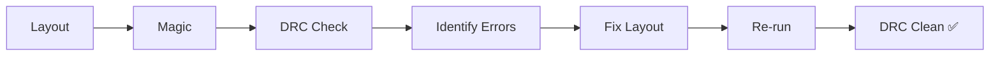
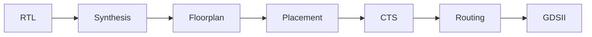
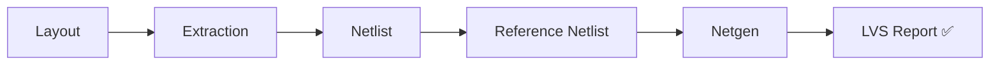

# 🔬 Day 10 — Complete Lab Code & Command Summary
### VSD Physical Verification Workshop | SKY130 PDK

[]()
[]()
[]()
[]()
[](../LICENSE)

> A consolidated, single-reference walkthrough of every terminal command, script, and workflow used across the workshop — from layout generation and DRC, through OpenLane PNR, to final LVS sign-off.

---

## 📑 Table of Contents

1. [Overview](#-overview)
2. [Lab Sessions Covered](#-lab-sessions-covered)
3. [Basic Linux Terminal Commands](#1-basic-linux-terminal-commands)
4. [Day 2 — DRC Lab](#2-day-2--drc-lab)
5. [Day 4 — Physical Verification Lab](#3-day-4--physical-verification-lab)
6. [Day 6 — Lab Session](#4-day-6--lab-session)
7. [Day 7 — OpenLane / PNR Lab](#5-day-7--openlane--pnr-lab)
8. [Day 9 — LVS Lab](#6-day-9--lvs-lab)
9. [Tools Used](#7-tools-used)
10. [File Types Reference](#8-file-types)
11. [End-to-End Flow](#9-complete-flow)
12. [Repository Structure](#10-repository-structure)
13. [Final Learning Outcomes](#11-final-learning-outcomes)

---

## 📖 Overview

The tenth and final day of the VSD Physical Verification workshop was dedicated to **consolidating** the practical work completed throughout the lab sessions.

This document brings together:

- 🖥️ Terminal-based Linux commands used during the labs
- 🛠️ Tool-specific commands (Magic, Netgen, OpenLane)
- 📜 TCL and shell scripts used for automation
- 🧩 Layout and netlist related files
- ✅ DRC verification commands
- 🔄 OpenLane / RTL-to-GDS workflow commands
- 🔍 LVS and Netgen commands
- 📂 References to the original lab folders containing the complete files

---

## 🗂️ Lab Sessions Covered

| Lab Day | Lab Area                  | Main Tools             | Reference                  |
|:-------:|----------------------------|-------------------------|-----------------------------|
| Day 2   | DRC Lab                    | Magic, SKY130           | [`Day2_Lab/`](../Day2_Lab/) |
| Day 4   | Physical Verification Lab  | Magic / related tools   | [`Day4_Lab/`](../Day4_Lab/) |
| Day 6   | Front-end / Back-end Lab   | Workshop tools          | [`Day6_Lab/`](../Day6_Lab/) |
| Day 7   | PNR / OpenLane Lab         | OpenLane, Linux         | [`Day7_Lab/`](../Day7_Lab/) |
| Day 9   | LVS Lab                    | Magic, Netgen           | [`Day9_Lab/`](../Day9_Lab/) |

---

## 1. Basic Linux Terminal Commands

Core navigation and file-handling commands used throughout every lab session.

```bash
pwd                     # print working directory
ls                      # list files
ls -l                   # detailed listing
cd <directory>          # change directory
cd ..                   # go up one level
mkdir <directory_name>  # create directory
cp <source> <dest>      # copy file
mv <source> <dest>      # move / rename file
rm <file>                # remove file
cat <file>               # print file contents
less <file>               # paginated view
nano <file>                # edit file
chmod +x <script>          # make script executable
./<script>                  # run script
```

<details>
<summary>📂 Checking files and directories</summary>

```bash
pwd
ls
ls -l
find . -type f
```
</details>

<details>
<summary>📁 Creating and entering a lab directory</summary>

```bash
mkdir <lab_directory>
cd <lab_directory>
```
</details>

<details>
<summary>▶️ Running a shell script</summary>

```bash
chmod +x run_drc.sh
./run_drc.sh
```
</details>

---

## 2. Day 2 — DRC Lab
**`PV_D1SK2` — DRC Lab**

Focused on **Design Rule Checking** using Magic and the SKY130 technology node.

### Topics Covered
- [x] Magic Installation
- [x] Introduction to DRC
- [x] DRC Errors
- [x] DRC Errors — Part 2
- [x] Resolving DRC Errors
- [x] DRC Clean

### 📄 Important Files
```text
Day2_Lab/
├── drc_test.tcl
└── run_drc.sh
```

### DRC Commands

```bash
magic -d XR -T sky130A
magic -d XR -T sky130A drc_test.tcl
```

```tcl
drc check
drc why
drc list
```

### Run Script
```bash
chmod +x run_drc.sh
./run_drc.sh
```

### DRC Flow



---

## 3. Day 4 — Physical Verification Lab
📂 Stored in [`Day4_Lab/`](../Day4_Lab/)

### Topics
- GDS reading
- Ports and pin information
- Abstract views
- Layout inspection
- Physical verification tasks

### Basic Navigation
```bash
cd Day4_Lab
ls -l
```

---

## 4. Day 6 — Lab Session
📂 Stored in [`Day6_Lab/`](../Day6_Lab/)

### Structure
```text
Day6_Lab/
├── input/
├── scripts/
└── output/
```

### Commands
```bash
cd Day6_Lab
ls
```

---

## 5. Day 7 — OpenLane / PNR Lab

### RTL-to-GDS Flow



### Navigation
```bash
cd <OpenLane_directory>
ls
```

---

## 6. Day 9 — LVS Lab
**`PV_D5SK2` — LVS Labs**

### LVS Flow



### Netgen Command
```bash
netgen -batch lvs \
  "<layout_netlist> <layout_cell>" \
  "<source_netlist> <source_cell>" \
  <setup_file>
```

### Interactive Mode
```bash
netgen
```

### ⚠️ Common LVS Issues
| Issue | Description |
|---|---|
| Missing devices | Device present in one netlist but not the other |
| Extra devices | Unexpected extra device in extracted netlist |
| Wrong pins | Pin mapping mismatch |
| Net mismatch | Nets not matching between layout and schematic |
| Connectivity errors | Broken or incorrect connections |

---

## 7. Tools Used

| Tool         | Purpose        |
|--------------|----------------|
| 🧲 Magic      | Layout + DRC   |
| 🔍 Netgen     | LVS            |
| ⚙️ OpenLane   | RTL-to-GDS     |
| 🧪 SKY130 PDK | Technology     |
| 🔌 SPICE      | Netlists       |
| 🐧 Linux      | Execution      |

---

## 8. File Types

| Extension | Use            |
|-----------|----------------|
| `.tcl`    | Tool scripts   |
| `.sh`     | Shell scripts  |
| `.v`      | Verilog        |
| `.spice`  | Netlist        |
| `.gds`    | Layout         |
| `.lef`    | Library        |
| `.def`    | Design data    |
| `.mag`    | Magic layout   |
| `.log`    | Logs           |

---

## 9. Complete Flow


---

## 10. Repository Structure

```text
VSD-Physical-Verification/
│
├── Day1_Theory/
├── Day2_Lab/
├── Day3_Theory/
├── Day4_Lab/
├── Day5_Theory/
├── Day6_Lab/
├── Day7_Lab/
├── Day8_Theory/
├── Day9_Lab/
└── Day10_Summary/
    └── README.md   ← you are here
```

---

## 11. Final Learning Outcomes

- ✅ Linux VLSI workflow
- ✅ DRC debugging
- ✅ LVS verification
- ✅ OpenLane flow
- ✅ Layout understanding
- ✅ Netlist comparison
- ✅ Physical design basics

---

### 📝 Summary
Day 10 consolidates all practical commands and workflows from the workshop into a single reference for revision and GitHub documentation.

<p align="center">
Made as part of the <b>VSD-IAT / SKY130</b> Physical Verification Workshop
</p>
